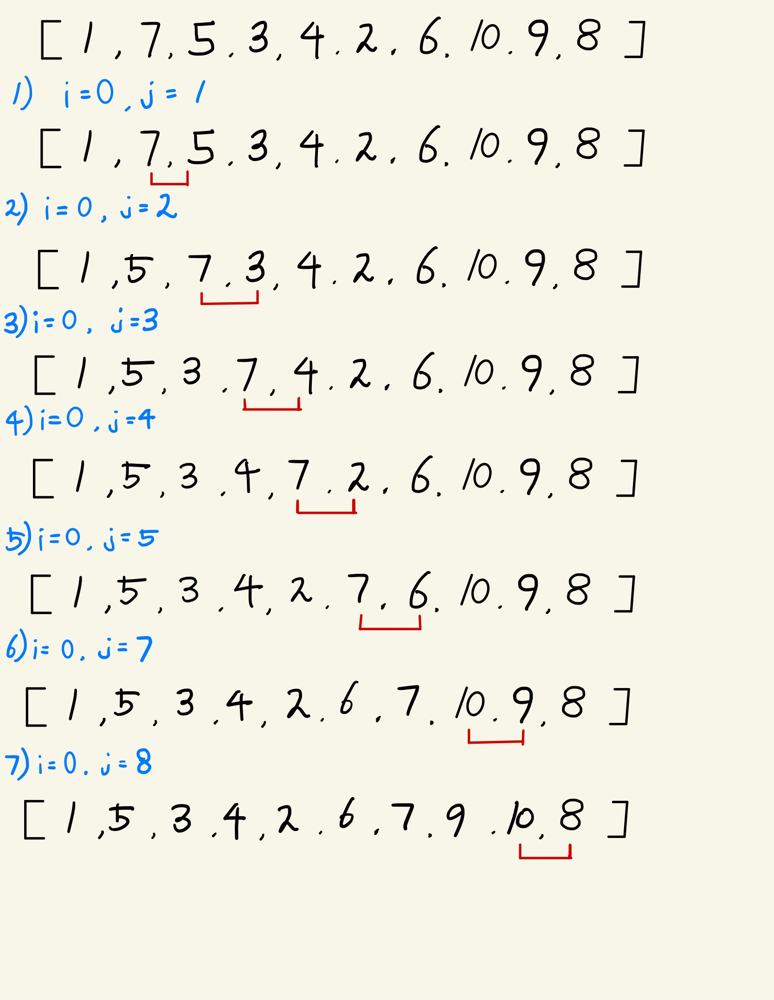
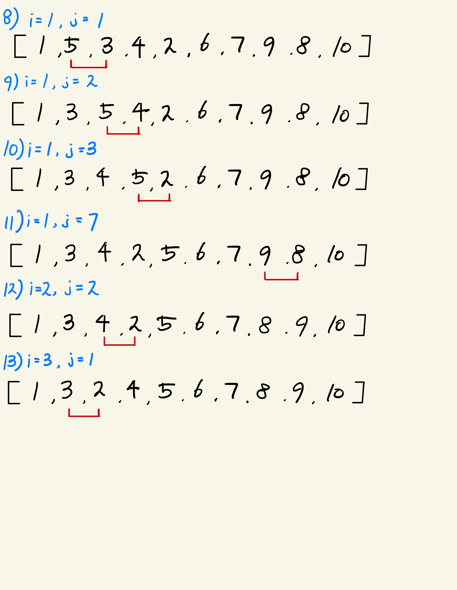
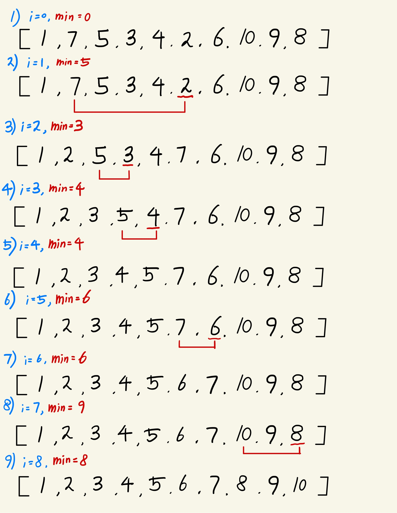
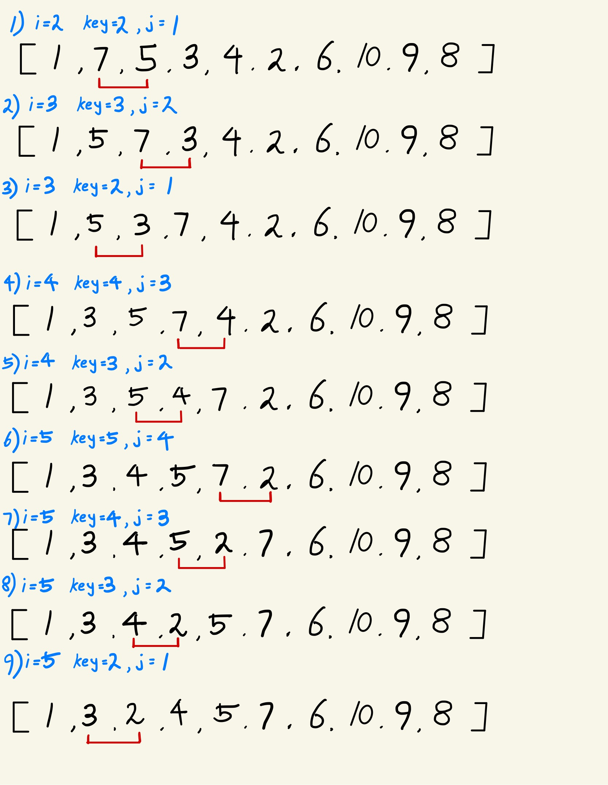
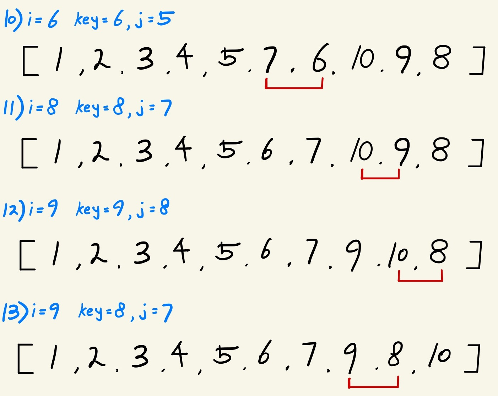
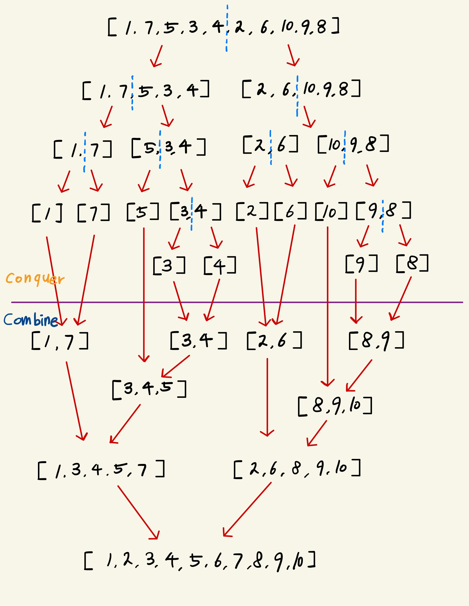
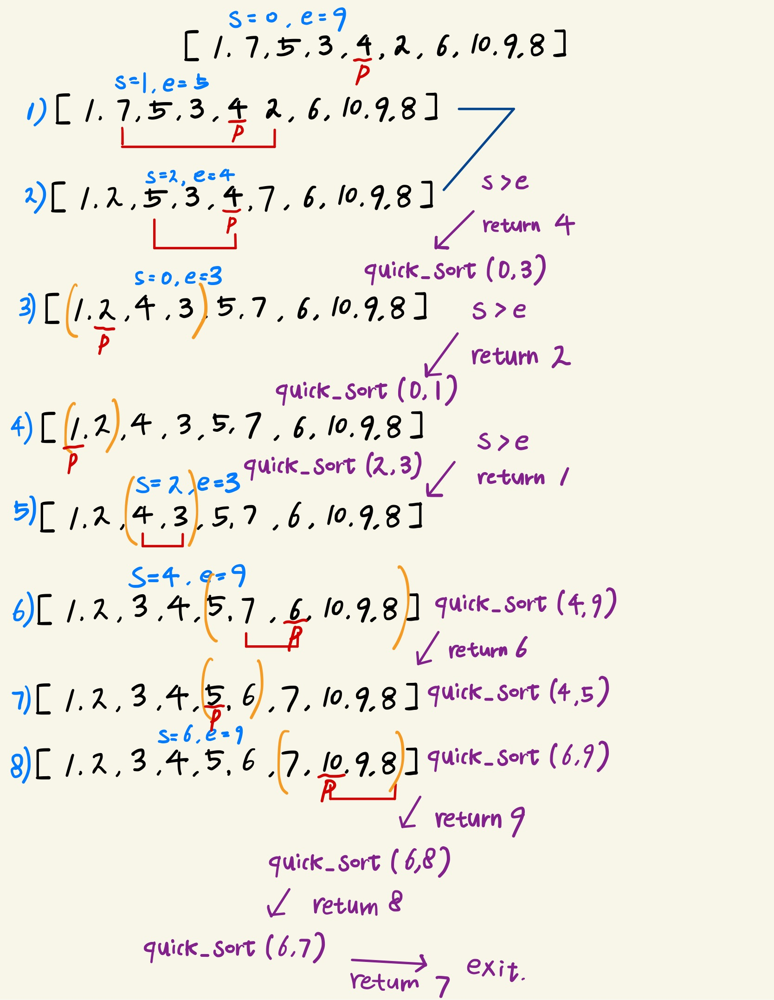

### 📌 Goal

- [x] 버블정렬, 선택정렬, 삽입정렬, 합병정렬을 직접 만들어본다.
- [x] 각 정렬 알고리즘의 특징, 장단점을 정리한다.
- [x] 알고리즘을 그림으로 직접 그려본다.
- [ ] 모든 알고리즘의 흐름을 브라우저단에 그려본다.
- [x] 학습한 정렬 알고리즘들의 시간복잡도를 이해하자
- [ ] setTimeout으로 랜덤 데이터를 정렬하는데 시간이 얼마나 소요되는지 체킹해보자.

## 정렬 알고리즘 ?

정렬 알고리즘은 원소들을 번호순이나 사전 순서와 같이 일정한 `순서`대로 오름차순 또는 내림차순으로 열거하는 알고리즘!

대표적인 정렬 알고리즘 6가지(버블정렬, 선택정렬, 삽입정렬, 합병정렬, 퀵정렬, 힙정렬)를 직접 구현해보면서 정리해보려한다. 우선은 비교적 쉬운 알고리즘들을 직접 만들어보고 이해가 되면 힙정렬은 다음 글에서 정리할 예정

### 1. 버블정렬

버블정렬 ? 인접한 두 항목의 값을 비교해서 일정한 기준을 만족하면 서로 교환하여 정렬하는 방식이라고 널리 알려져 있는 이 버블정렬. 핵심은 배열의 뒷쪽부터 정렬하는 방법

- 오름차순일 경우 두 항목의 값을 비교하여 앞의 값이 더 크다면 두 항목의 값을 교환

- 내림차순일 경우 두 항목의 값을 비하여 앞의 값이 더 작으면 두 항목의 값을 교환

;
;

장점 ? 다른 정렬 알고리즘에 비하여 비교적 구현이 매우 쉬움

단점 ? 비교작업이 너무 많기 때문에 연산 시간이 오래 걸린다. => 실무에서는 거의 쓰이지 않는 알고리즘

```javascript
export const bubbleSort = (datas) => {
  const arr = _.cloneDeep(datas);
  let operationNum = 0;
  let swapNum = 0;

  for (let i = 0; i < arr.length - 1; i++) {
    for (let j = 0; j < arr.length - 1 - i; j++) {
      operationNum++;
      if (arr[j] > arr[j + 1]) {
        swap(arr, j, j + 1);
      }
    }
  }
  console.log(`비교 연산횟수 : ${operationNum}`);
  console.log(`교환횟수 : ${swapNum}`);
  console.log(arr);
  return arr;
};
```

---

> 버블정렬을 조금이라도 더 개선해보자.

🤔 How? 실제로 데이터를 앞에서부터 처리하다 보면, 데이터를 계속 체킹하지 않아도 중간에 정렬되어 있을 경우가 있다.

예를들어, [1, 7, 2, 4, 6, 9, 3, 12, 11, 10] 이라는 배열 안의 요소를 정렬한다고 가정했을시, 이미 4번째 단계에서 정렬이 완료된 상태인데도 불구하고 위 코드를 사용한다면 9번째까지 계속해서 불필요한 연산을 하게 된다.

한 번 수정해보자..

```javascript
export const bubbleSort = (datas) => {
  const arr = _.cloneDeep(datas);
  let operationNum = 0;
  let swapNum = 0;
  let flag = false;
  for (let i = 0; i < arr.length - 1; i++) {
    flag = true;
    for (let j = 0; j < arr.length - 1 - i; j++) {
      operationNum++;
      if (arr[j] > arr[j + 1]) {
        flag = false;
        swap(arr, j, j + 1);
        swapNum++;
      }
    }
    if (flag) break;
  }
  console.log(`비교 연산횟수 : ${operationNum}`);
  console.log(`교환횟수 : ${swapNum}`);
  console.log(arr);
  return arr;
};
```

flag값이 없었을때는 정렬이 이미 되어있는 상태여도 계속해서 비교를 하여 총 45번 횟수를 비교하지만, flag 값으로 이미 정렬되어 있는 경우엔 break로 빠져나와 35번으로 줄일 수 있었다.

> 비교횟수가 현저히 줄어든거 볼 수 있지만, 중간에 이 flag라는 변수와, 조건문의 추가로 내부 반복문이 모든 배열을 순회하지 않고 정렬이 되었을시 break 된다. 이 정도의 변수추가와 조건문 추가는 내가 생각하기에 가독성상 큰 문제라고 생각하지 않기 때문에 맨 처음에 작성했던 코드보다 더 좋다고 생각한다.

---

### 2. 선택정렬

선택 정렬 ? 맨 앞부터 모든 요소들을 순회하여 그 중 가장 작은 값을 뽑아 가장 앞의 데이터와 교환해 나가는 정렬 방식으로 맨 앞부터 차곡차곡 정렬 된다.



장점 ? 이동횟수가 미리 결정되어져 있다. / 버블정렬에 비해 비교횟수는 더 많겠지만 실제로 교환하는 횟수는 적기 때문에 많은 교환이 일어날때 효율적

단점 ?

1. 안정성이 좋지 않다. Why => 같은 값인 레코드 경우 상대적인 위치가 변경이 될 수 있다.
2. 배열이 이미 정렬되어 있어도 관계없이 동일한 연산량을 가지고 있기 때문에 최적화 여지가 적어 다른 O(N^2) 대비해도 성능이 떨어지는 편

```javascript
export const selectionSort = () => {
  const arr = _.cloneDeep(datas);
  let operationNum = 0;
  let swapNum = 0;
  for (let i = 0; i < arr.length - 1; i++) {
    let min = i;
    for (let j = i + 1; j < arr.length; j++) {
      operationNum++;
      if (arr[min] > arr[j]) {
        min = j;
      }
    }
    swap(arr, i, min);
    swapNum++;
  }
  console.log(`비교 연산횟수 : ${operationNum}`);
  console.log(`교환횟수 : ${swapNum}`);
  console.log(arr);
  return arr;
};
```

버블 정렬과 시간 복잡도는 동일하지만 자료의 swap을 반복하는 버블 정렬보단 조금? 빠르다.

---

### 3. 삽입정렬

삽입 정렬 ? 선택정렬 보다 조금 빠르며, 인덱스 1부터 시작하여 정렬이 되어있지 않는 요소를 정렬된 부분에 정렬되도록 삽입하는 과정을 반복하는 알고리즘




장점 ?

1. 정렬이 어느정도 되어있을 경우엔 다른 퀵, 힙 정렬보다 더 효율적일 수 있음

2. 위에서 살펴본 선택정렬과 버블정렬에 비하면 상대적으로 빠른편에 속한다.

단점 ? 많은 레코드들의 이동이 있기 때문에 레코드 수가 많고 레코드 크기가 클 경우 비효율적.. (비교적 많은 배열 값들의 이동을 포함하므로 배열 길이가 길어질수록.. )

```javascript
export const insertionSort = (datas) => {
  const arr = _.cloneDeep(datas);
  let operationNum = 0;
  let swapNum = 0;

  for (let i = 1; i < arr.length; i++) {
    let key = i;
    for (let j = i - 1; j >= 0; j--) {
      operationNum++;
      if (arr[key] < arr[j]) {
        swap(arr, j, key);
        key = j;
        swapNum++;
      } else break;
    }
  }

  console.log(`비교 연산횟수 : ${operationNum}`);
  console.log(`교환횟수 : ${swapNum}`);
  console.log(arr);
};
```

---

### 4. 합병정렬

합병 정렬 ? 전체 배열의 반으로 쪼개고 쪼개서 1개가 될 때까지 쪼갠다음에 다시 합병과 정렬을 하면서 정렬된 배열을 마지막에 만드는 방법이다. 합병정렬은 그림으로 보면 확 이해가 빨라서 직접 그려보았다.



```javascript
const conquer = (arr) => {
  if (arr.length === 1) return arr;
  const mid = parseInt(arr.length / 2);
  const leftArr = arr.slice(0, mid);
  const rightArr = arr.slice(mid);
  return combine(conquer(leftArr), conquer(rightArr));
};

const combine = (left, right) => {
  const tmp = [];
  let leftIndex = 0;
  let rightIndex = 0;

  while (leftIndex < left.length && rightIndex < right.length) {
    if (left[leftIndex] < right[rightIndex]) {
      tmp.push(left[leftIndex]);
      leftIndex++;
    } else {
      tmp.push(right[rightIndex]);
      rightIndex++;
    }
  }

  return tmp.concat(left.slice(leftIndex), right.slice(rightIndex));
};

export const mergeSort = (datas) => {
  const arr = _.cloneDeep(datas);
  const sortedArr = conquer(arr);
  console.log(sortedArr);
};
```

장점 ?

- 퀵 정렬과 달리 기준값을 설정없이 무조건 절반으로 분할하기 때문에 기준값에 따라 성능이 달라지는 경우가 없다. 따라서 항상 O(nlogn) 이라는 시간복잡도를 가지게 된다.

- 배열을 연결 리스트로 구현하면 인덱스만 변경되기 때문에 데이터 이동 및 복사가 불필요해진다.

단점 ?

- 공간이 많이 필요하다. Why? 정렬을 하기 위해선 데이터 전체 크기만한 메모리가 더 필요하기 때문
- 추가적인 메모리를 할당할 수 없다면(합병정렬의 제한) => 합병정렬을 사용할 수 없기 때문에 퀵을 사용

---

### 5. 퀵정렬

퀵정렬 ? 분할 정복 알고리즘의 하나로, 평균적으로 매우 빠른 수행 속도를 자랑하는 정렬 방법으로 알려져있다. 주어진 배열안에서 피벗(기준값)을 정하여 기준값 보다 작은 요소들은 왼쪽, 큰 요소들은 오른쪽으로 옮기면서 재귀적으로 정렬하는 방식



```javascript
const partition = (arr, start, end) => {
  const pivot = arr[parseInt((start + end) / 2)];
  while (start <= end) {
    while (arr[start] < pivot) start++;
    while (arr[end] > pivot) end--;
    if (start <= end) {
      swap(arr, start, end);
      start++;
      end--;
    }
  }
  return start;
};

const _quickSort = (arr, start, end) => {
  const index = partition(arr, start, end);
  if (start < index - 1) {
    _quickSort(arr, start, index - 1);
  }
  if (index < end) {
    _quickSort(arr, index, end);
  }
};

export const quickSort = (datas) => {
  const arr = _.cloneDeep(datas);
  _quickSort(arr, 0, arr.length - 1);
  console.log(arr);
};
```

장점 ?

1. 시간 복잡도가 O(nlog₂n)를 가지는 다른 정렬 알고리즘과 비교했을 때도 가장 빠르다.

2. 추가적은 메모리 공간을 필요로 하지 않는다.

단점 ?

1. 정렬된 리스트에 대해서는 불균형 분할에 의하여 오히려 수행시간이 더 많이 걸린다. (따라서 피벗값을 대체적으로 중간값을 기준으로 정하여 균등하게 분할한다.)

| 알고리즘 | 최선 시간 복잡도 | 평균 시간 복잡도 | 최악 시간 복잡도 | 안정/불안정 |
| -------- | ---------------- | ---------------- | ---------------- | ----------- |
| 버블정렬 | O(N2)            | O(N2)            | O(N2)            | 안정        |
| 선택정렬 | O(N2)            | O(N2)            | O(N2)            | 불안정      |
| 삽입정렬 | O(N)             | O(N2)            | O(N2)            | 안정        |
| 합병정렬 | O(NlogN)         | O(NlogN)         | O(NlogN)         | 안정        |
| 퀵정렬   | O(NlogN)         | O(NlogN)         | O(N2)            | 불안정      |
| 힙정렬   |                  |                  |                  |             |
